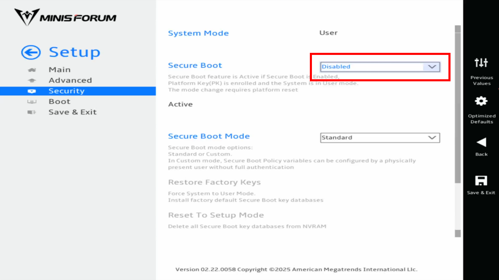
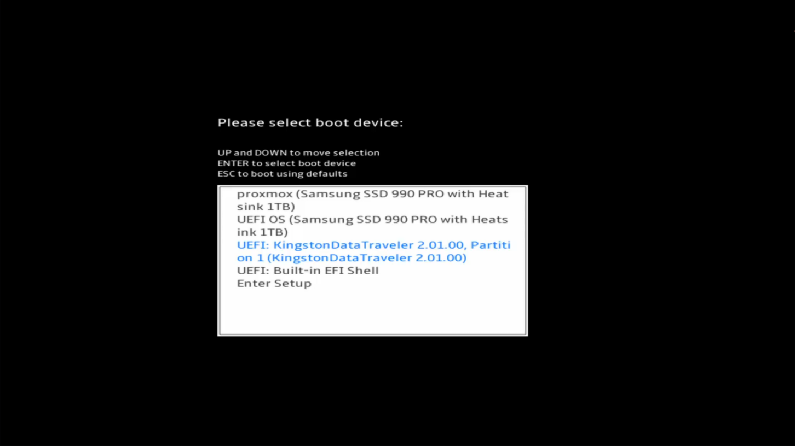
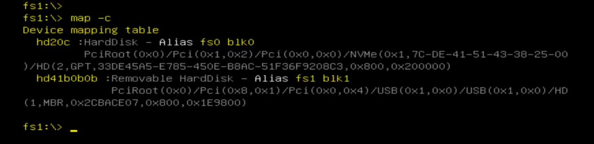
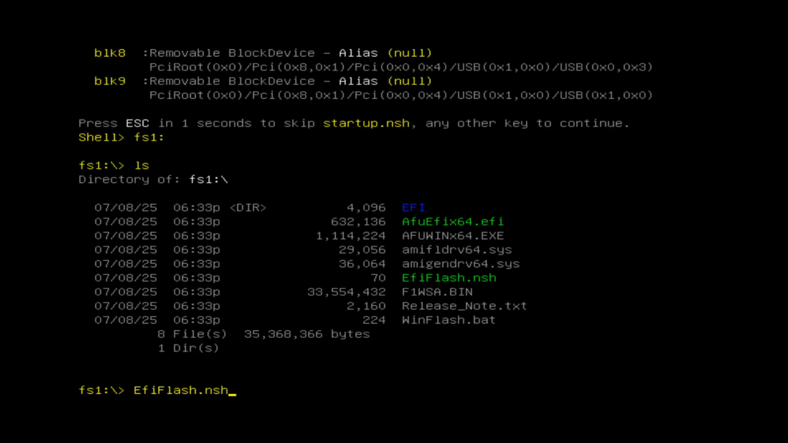

# Minisforum BIOS Update

This guide explains how to create a bootable USB drive on Linux to update the BIOS of a Minisforum MS-A2.

> [!WARNING]
> This guide is not official and I do not take any responsibility for any damage that may occur. Proceed with caution and ensure you have a backup of important data before continuing.

## Prerequisites

- USB flash drive (minimum 1GB)
- Required packages:
  - `gptfdisk` (provides `sgdisk`)
  - `parted` (provides `partprobe`)
  - `dosfstools` (for FAT32 formatting)
- BIOS update file from the [Minisforum website](https://www.minisforum.com/pages/product-info)

### Installing Required Packages

```bash
# For Debian/Ubuntu-based distributions
sudo apt install gptfdisk parted dosfstools

# For Fedora/RHEL-based distributions
sudo dnf install gdisk parted dosfstools

# For Arch-based distributions
sudo pacman -S gptfdisk parted dosfstools
```

> [!IMPORTANT]
> Updating the BIOS will restore the system to its factory default state and _will format all hard drives if RAID mode_ is enabled in the BIOS.

## Step-by-Step Guide

### 1. Prepare the USB drive

<details>
<summary>Identify your target USB drive</summary>

Use one of these commands to identify your USB drive:

```bash
# Show disks with filesystem information
lsblk -f

# Alternative with more details
sudo fdisk -l
```

> [!TIP]
> Look for your USB drive size and name. It will typically be listed as `/dev/sdX` (where X is a letter like a, b, c) or `/dev/sdX1` (where 1 is the partition number).
>
> Example output from `lsblk -f`:
>
> ```
> NAME   FSTYPE   LABEL     UUID                                 MOUNTPOINT
> sda
> ├─sda1 ext4     /         1acd2288-1c56-4fcd-9db0-8a95a6a4686e /
> ├─sda2 swap     [SWAP]    1a2b3c4d-5e6f-7g8h-9i0j-1k2l3m4n5o6p [SWAP]
> sdb    vfat     USB_DRIVE 1234-ABCD                            /media/user/USB_DRIVE
> ```
>
> In this example, `/dev/sdb` is the USB drive.

</details>

<details>
<summary>Wipe the target USB drive</summary>

> [!WARNING]
> The following commands will permanently destroy all data on the target USB drive!

```bash
# Replace /dev/sdX with your actual USB device (without partition number)
sudo sgdisk --zap-all /dev/sdX
sudo partprobe /dev/sdX
```

> [!IMPORTANT]
> Make absolutely sure you're using the correct device identifier. Using the wrong identifier could result in data loss on your system drives.

</details>

### 2. Create and Format Partition

Create the USB partition with EFI type:

```bash
# Replace /dev/sdX with your actual USB device (without partition number)
sudo sgdisk -a1 -n1:0:0 -c 1:efiboot -t1:EF00 /dev/sdX
```

Format the partition as FAT32:

```bash
# Replace /dev/sdX1 with your actual USB device partition
sudo mkfs.vfat -F32 -n "WINPE" /dev/sdX1
```

> [!NOTE]
> After running `sgdisk`, your USB device will have one partition (e.g., if your device is `/dev/sdb`, the partition will be `/dev/sdb1`).

### 3. Copy the Required Files

#### Mount the USB drive

```bash
# Create a mount point if it doesn't exist
sudo mkdir -p /mnt

# Replace /dev/sdX1 with your actual USB device partition
sudo mount -t vfat -o uid=$(id -u),gid=$(id -g),umask=022 /dev/sdX1 /mnt
```

> [!TIP]
> The command above automatically uses your current user and group IDs. Common values are:
>
> - Most Linux distributions: uid=1000, gid=1000
> - NixOS: uid=1000, gid=100
>
> You can verify your IDs with `id -u` and `id -g`.

#### Copy the files

1. This repository contains the required EFI boot files inside the `WINPE` directory:

   ```bash
   # Copy the EFI directory to the mounted USB drive
   cp -r WINPE/EFI /mnt/
   ```

2. Copy the BIOS update files to the mounted USB drive:
   ```bash
   # Replace /path/to/bios/update with the actual path to your downloaded BIOS files
   cp -r /path/to/bios/update/* /mnt/
   ```

#### Verify the file structure

After copying, the USB drive should have this structure:

```
/mnt
├── EFI
│   └── BOOT
│       ├── BOOTX64.EFI
│       └── bootmgfw.efi
├── AfuEfix64.efi
├── AFUWINx64.exe
├── Efiflash.nsh (or Flash.nsh)
├── Release_Note.txt
└── ... (other BIOS update files)
```

#### Unmount the USB drive

```bash
sudo umount /mnt
```

> [!IMPORTANT]
> Make sure the USB drive is properly unmounted before removing it to prevent data corruption.

### 4. Disable Secure Boot in BIOS

1. Restart your Minisforum device
2. Press the **Delete** key repeatedly during startup to enter BIOS
3. Navigate to `Settings` → `Security` → `Secure Boot`
4. Set Secure Boot to **Disabled**
5. Press **F4** to save and exit

<a href="files/turnoff_securebot.png" target="_blank">
  
</a>
<div style="text-align: center;">
  <em>Click to enlarge</em>
</div>

### 5. Boot from the USB Drive and Update BIOS

1. Insert the prepared USB drive into your Minisforum device
2. Restart the device
3. Press **F7** repeatedly during startup to enter the Boot Selection menu
4. Select your USB drive from the list
5. When the EFI Shell appears, enter the following commands in sequence (take a look at the table below for a description of each command):

```
map -c
fsX:
ls
EfiFlash.nsh
```

6. Follow the on-screen prompts to complete the BIOS update

| Command                       | Description                                                                                                                   |
| ----------------------------- | ----------------------------------------------------------------------------------------------------------------------------- |
| `map -c`                      | Lists all available drives. Your USB drive typically appears as **Removable HardDisk** (typically blk0, blk1, fs0, fs1, etc.) |
| `fsX:` or `blkX:`             | Selects and changes to the USB drive (replace X with the correct number from the previous command)                            |
| `ls`                          | Lists files in the current directory to verify you're in the correct location                                                 |
| `EfiFlash.nsh` or `Flash.nsh` | Runs the BIOS update script. Try `Flash.nsh` if `EfiFlash.nsh` isn't present                                                  |

<a href="files/boot_fromusb.png" target="_blank">
  
</a>
<div style="text-align: center;">
  <em>Click to enlarge</em>
</div>
<a href="files/efishell1.png" target="_blank">
  
</a>
<div style="text-align: center;">
  <em>Click to enlarge</em>
</div>
<a href="files/efishell2.png" target="_blank">
  
</a>
<div style="text-align: center;">
  <em>Click to enlarge</em>
</div>

> [!NOTE]
>
> - The BIOS update process may take several minutes to complete
> - The system will automatically reboot when finished
> - The first reboot after the update might take longer than usual
> - If the system appears to be stuck, wait at least 5 minutes before considering any intervention

## Troubleshooting

<details>
<summary>USB drive not detected in boot menu</summary>

- Make sure Secure Boot is disabled
- Try a different USB port (preferably USB 2.0 if available)
- Verify the USB drive was properly formatted with the EFI partition
- Some USB drives may not be compatible; try a different brand/model if possible
</details>

<details>
<summary>EFI Shell cannot find the flash script</summary>

- Make sure you've selected the correct drive with the `blkX:` or `fsX:` command
- Verify that the file structure on the USB drive matches the expected layout
- Check if the flash script is named differently (e.g., `Flash.nsh` instead of `Efiflash.nsh`)
</details>

<details>
<summary>BIOS update fails or system won't boot after update</summary>

- If the update fails, try the process again with a different USB drive
- If the system won't boot after update, try resetting the BIOS by removing the CMOS battery for 30 seconds (if accessible)
- As a last resort, contact Minisforum support for recovery options
</details>

## Credits

This guide is based on the work of:

- [rezzorix/minisforum-bios-updates](https://github.com/rezzorix/minisforum-bios-updates/tree/main)
